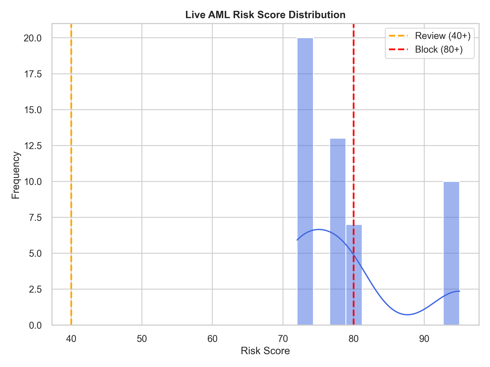
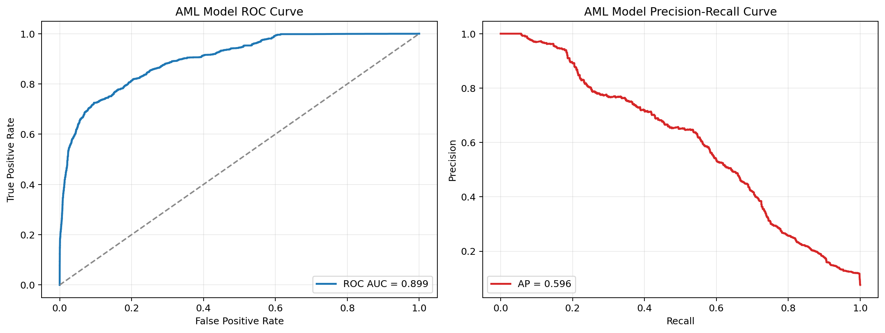
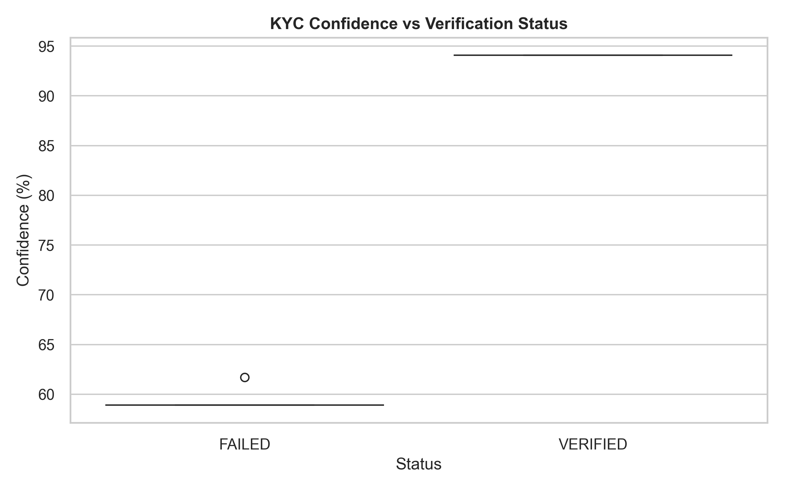
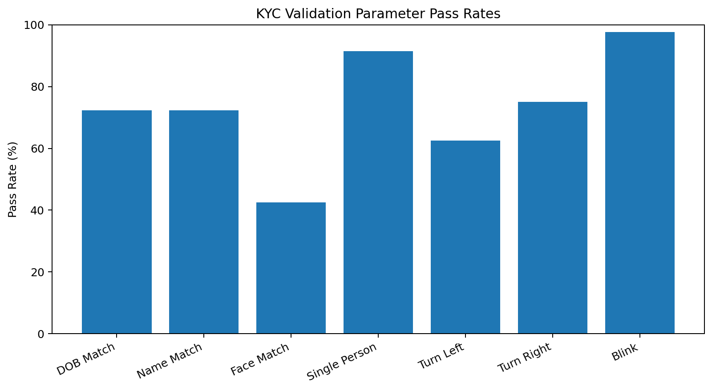
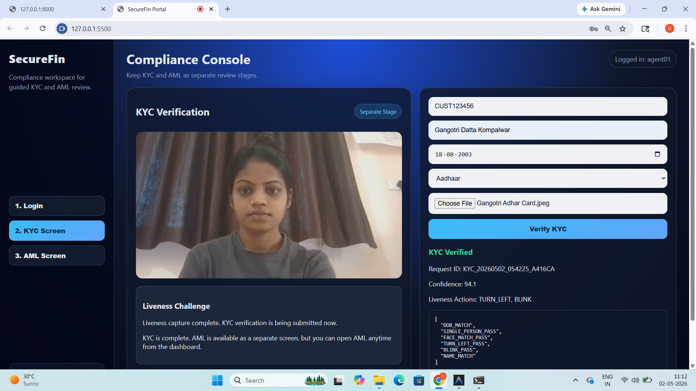
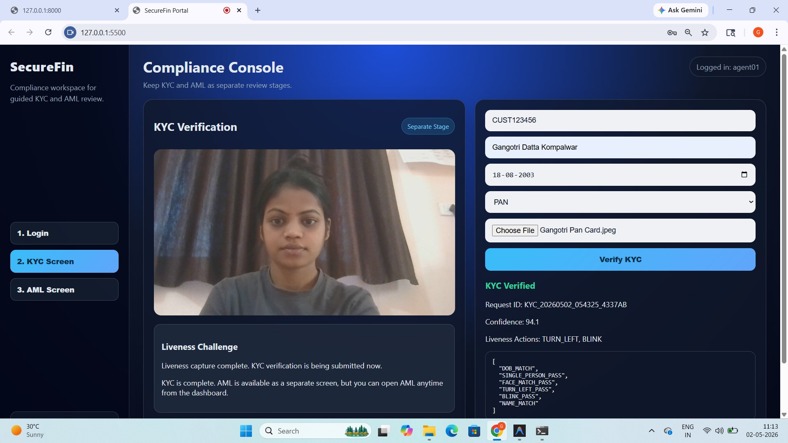
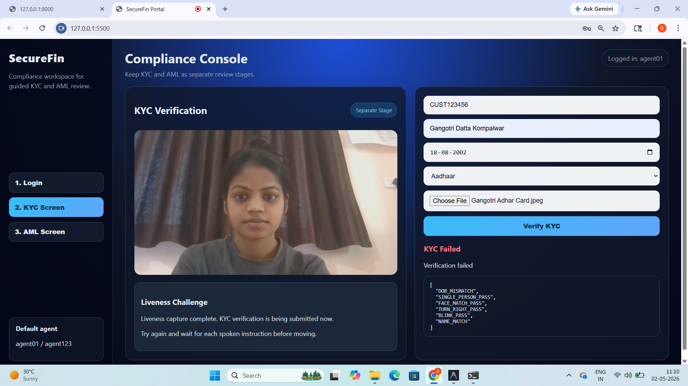
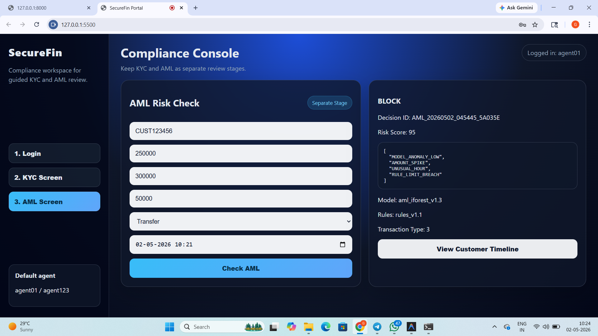

# SecureFin: Video KYC and AML Fraud Detection

SecureFin is an AI-powered academic prototype for automated identity verification (KYC) and financial anomaly detection (AML). It combines computer vision, optical character recognition, facial verification and machine-learning-based anomaly detection to identify suspicious activity.

## Key Features

### Identity Verification

- OCR-based data extraction from Aadhaar and PAN documents
- Face comparison between an identity document and live capture
- YOLOv8-based person detection
- Multi-person detection for suspicious verification attempts
- Guided liveness verification using prompted actions
- Date-of-birth and name validation
- KYC decisions with confidence scores and reason codes

### AML Anomaly Detection

- Isolation Forest model for financial anomaly detection
- Rule-based transaction validation
- Transaction risk scoring
- Real-time decisions: `ALLOW`, `REVIEW` or `BLOCK`
- Model training and evaluation scripts

### Security

- Password hashing using bcrypt
- JWT-based authentication
- Fernet encryption for uploaded identity documents
- Environment-based secret configuration
- SQLite-based local data storage
- Uploaded documents, databases and environment files excluded from Git

### Evaluation and Analytics

- AML classification report and confusion matrix
- AML performance and distribution visualizations
- KYC status and confidence distributions
- KYC reason-code frequency
- KYC validation-parameter visualization
- JSON-based evaluation metrics

## System Workflow

```text
Identity Document and Live Capture
                │
                ▼
      YOLOv8 Person Detection
                │
                ▼
         OCR Data Extraction
                │
                ▼
   Face Matching and Liveness Check
                │
                ▼
         KYC Decision Engine
                │
                ▼
   Isolation Forest + Business Rules
                │
                ▼
         ALLOW / REVIEW / BLOCK
```

## Project Structure

```text
video-kyc-aml-detection/
├── backend/
│   ├── main.py
│   ├── run_server.py
│   ├── aml.py
│   ├── kyc.py
│   ├── liveness.py
│   ├── ocr.py
│   ├── face_match.py
│   ├── yolo_detector.py
│   ├── security.py
│   ├── db.py
│   ├── prepare_data.py
│   ├── train_aml_model.py
│   ├── evaluate_aml_model.py
│   ├── evaluate_kyc_metrics.py
│   ├── aml_model.pkl
│   └── yolov8n.pt
├── frontend/
│   ├── index.html
│   ├── script.js
│   └── styles.css
├── research_graphs/
│   ├── aml_classification_report.txt
│   ├── aml_confusion_matrix.png
│   ├── aml_distribution.png
│   ├── aml_metrics.json
│   ├── aml_performance_graph.png
│   ├── aml_scatter.png
│   ├── kyc_confidence.png
│   ├── kyc_confidence_timeline.png
│   ├── kyc_metrics.json
│   ├── kyc_reason_code_frequency.png
│   ├── kyc_status_distribution.png
│   └── kyc_validation_parameters.png
├── screenshots/
│   ├── aml-block-decision.png
│   ├── aml-review-decision.png
│   ├── kyc_failed_DOB_Mismatch.png
│   ├── kyc_verified_adhar.png
│   └── kyc_verified_pan.png
├── database/                  # Generated locally and excluded from Git
├── frontend_server.py
├── generate_graphs.py
├── run_project.ps1
├── requirements.txt
├── .gitignore
└── README.md
```

## Tech Stack

- **Programming Language:** Python
- **Backend:** FastAPI, Uvicorn
- **Frontend:** HTML, CSS, JavaScript
- **Computer Vision:** YOLOv8, OpenCV
- **OCR:** Tesseract OCR, Pytesseract
- **Facial Verification:** DeepFace
- **Machine Learning:** Scikit-learn, Isolation Forest
- **Database:** SQLite
- **Security:** JWT, bcrypt, Fernet encryption
- **Visualization:** Matplotlib

## Installation

### Prerequisites

Install the following software:

- Python 3.10 or later
- Git
- Tesseract OCR

On Windows, Tesseract OCR is commonly installed at:

```text
C:\Program Files\Tesseract-OCR\tesseract.exe
```

### Clone the Repository

```bash
git clone https://github.com/kompalwargangotri/video-kyc-aml-detection.git
cd video-kyc-aml-detection
```

### Create a Virtual Environment

```bash
python -m venv venv
```

Activate it on Windows:

```powershell
venv\Scripts\activate
```

Activate it on Linux or macOS:

```bash
source venv/bin/activate
```

### Install Dependencies

```bash
pip install -r requirements.txt
```

## Running the Application

### Option 1: PowerShell Launcher

On Windows, run:

```powershell
.\run_project.ps1
```

If PowerShell script execution is disabled:

```powershell
Set-ExecutionPolicy -Scope Process Bypass
.\run_project.ps1
```

### Option 2: Run Manually

Open the first terminal and start the backend:

```powershell
cd backend
python -m uvicorn main:app --reload --host 127.0.0.1 --port 8000
```

Open another terminal from the project root and start the frontend:

```powershell
python frontend_server.py
```

After starting the application:

- **Backend:** `http://127.0.0.1:8000`
- **Frontend:** `http://127.0.0.1:5500`
- **API Documentation:** `http://127.0.0.1:8000/docs`

## Demo Login Accounts

The following accounts are intended only for local demonstration:

| Role | Username | Password |
|---|---|---|
| Agent | `agent01` | `agent123` |
| Reviewer | `reviewer01` | `review123` |

> Never use these credentials in a publicly deployed application.

## Model Evaluation

Run the AML evaluation from the project root:

```powershell
python backend/evaluate_aml_model.py
```

Run the KYC evaluation:

```powershell
python backend/evaluate_kyc_metrics.py
```

Generate database-driven research graphs:

```powershell
python generate_graphs.py
```

Evaluation outputs are stored in the `research_graphs/` directory.

## Evaluation Visualizations

### AML Confusion Matrix


### AML Distribution



### AML Performance



### KYC Confidence



### KYC Status Distribution


### KYC Reason-Code Frequency


### KYC Validation Parameters



## Application Screenshots

### KYC Verification – Aadhaar



### KYC Verification – PAN



### KYC Verification – Date of Birth Mismatch



### AML Review Decision


### AML Block Decision



## Data and Privacy

The following files are intentionally excluded from this repository:

- Environment variables and encryption keys
- SQLite database files
- Uploaded identity documents
- Encrypted KYC captures
- Temporary files and logs
- Raw transaction datasets

Use synthetic or properly anonymized data when reproducing the experiments.

## Responsible Use

This project is an academic prototype created for learning and demonstration. It should not be used as a production KYC or financial decision-making system without:

- Security auditing
- Regulatory and legal review
- Bias and fairness testing
- Extensive performance validation
- Secure infrastructure and access controls

## Future Improvements

- Improve liveness detection against presentation attacks
- Add identity-document forgery detection
- Evaluate the system on larger and more diverse datasets
- Add automated testing and continuous integration
- Containerize the application using Docker
- Deploy the API and frontend securely
- Add role-based access control and audit logging

## Author

**Gangotri Kompalwar**

- [GitHub](https://github.com/kompalwargangotri)
- [LinkedIn](https://www.linkedin.com/in/gangotri-kompalwar-4635b9359)
- [Email](mailto:kompalwargangotri@gmail.com)