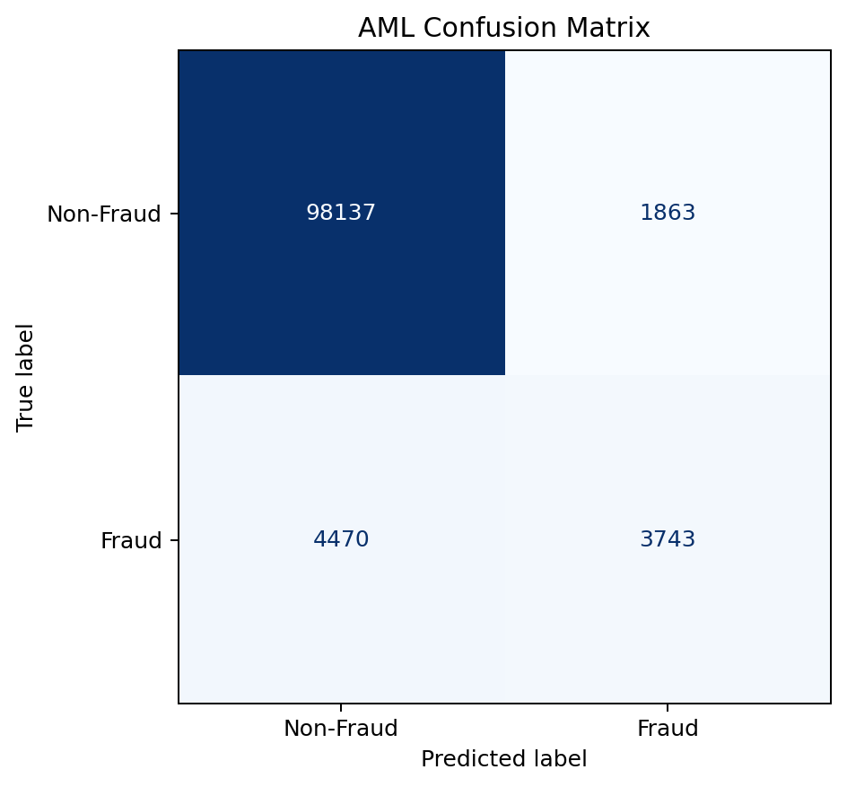
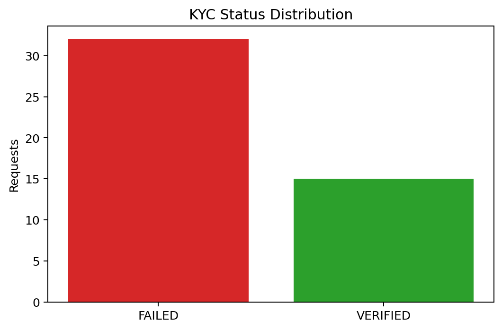
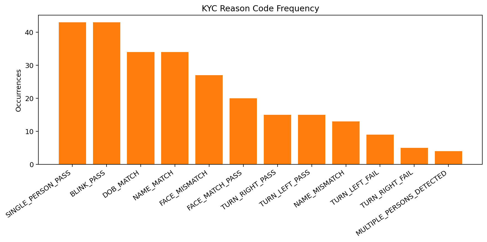

# SecureFin: Video KYC and AML Fraud Detection

SecureFin is an AI-powered prototype for automated identity verification (KYC) and financial anomaly detection (AML). It combines computer vision, optical character recognition, facial verification and machine-learning-based anomaly detection to identify suspicious activity.

## Key Features

### Identity Verification

- OCR-based information extraction from identity documents
- Face comparison between an identity document and live capture
- YOLOv8-based person detection
- Multi-person detection to identify potentially suspicious verification attempts
- Guided liveness verification

### AML Anomaly Detection

- Isolation Forest model for financial anomaly detection
- Rule-based transaction validation
- Real-time decisions: `ALLOW`, `REVIEW` or `BLOCK`
- Model training and evaluation scripts

### Security

- Password hashing using bcrypt
- JWT-based authentication
- Fernet encryption for sensitive information
- SQLite-based data storage
- Security and database utility modules

### Evaluation

- AML classification report
- AML confusion matrix
- KYC status distribution
- KYC reason-code frequency
- KYC validation parameter visualization

## System Workflow

```text
Identity Document / Live Capture
              │
              ▼
    YOLOv8 Person Detection
              │
              ▼
       OCR Data Extraction
              │
              ▼
 Face Matching and Liveness Check
              │
              ▼
       KYC Decision Engine
              │
              ▼
 Isolation Forest + Business Rules
              │
              ▼
       ALLOW / REVIEW / BLOCK
```

## Project Structure

```text
video-kyc-aml-detection/
├── main.py
├── run_server.py
├── aml.py
├── kyc.py
├── liveness.py
├── ocr.py
├── face_match.py
├── yolo_detector.py
├── security.py
├── db.py
├── prepare_data.py
├── train_aml_model.py
├── evaluate_aml_model.py
├── evaluate_kyc_metrics.py
├── aml_model.pkl
├── yolov8n.pt
├── index.html
├── script.js
├── styles.css
├── aml_classification_report.txt
├── aml_confusion_matrix.png
├── kyc_reason_code_frequency.png
├── kyc_status_distribution.png
├── kyc_validation_parameters.png
├── run_project.ps1
├── requirements.txt
└── README.md
```

## Tech Stack

- **Programming Language:** Python
- **Backend:** FastAPI, Uvicorn
- **Frontend:** HTML, CSS, JavaScript
- **Computer Vision:** YOLOv8, OpenCV
- **OCR:** Tesseract OCR, Pytesseract
- **Facial Verification:** DeepFace
- **Machine Learning:** Scikit-learn, Isolation Forest
- **Database:** SQLite
- **Security:** JWT, bcrypt, Fernet encryption

## Installation

### Prerequisites

Before running the project, install:

- Python 3.10 or later
- Git
- Tesseract OCR

On Windows, Tesseract OCR is commonly installed at:

```text
C:\Program Files\Tesseract-OCR\tesseract.exe
```

### Clone the Repository

```bash
git clone https://github.com/kompalwargangotri/video-kyc-aml-detection.git
cd video-kyc-aml-detection
```

### Create a Virtual Environment

```bash
python -m venv venv
```

Activate it on Windows:

```powershell
venv\Scripts\activate
```

Activate it on Linux or macOS:

```bash
source venv/bin/activate
```

### Install Dependencies

```bash
pip install -r requirements.txt
```

## Running the Application

### Option 1: PowerShell Launcher

On Windows, run:

```powershell
.\run_project.ps1
```

If script execution is disabled:

```powershell
Set-ExecutionPolicy -Scope Process Bypass
.\run_project.ps1
```

### Option 2: Run Manually

Start the backend:

```bash
python run_server.py
```

In another terminal, start the frontend:

```bash
python -m http.server 5500
```

After starting the application:

- **Backend:** `http://127.0.0.1:8000`
- **Frontend:** `http://127.0.0.1:5500`
- **API Documentation:** `http://127.0.0.1:8000/docs`

## Model Evaluation

Run the AML evaluation:

```bash
python evaluate_aml_model.py
```

Run the KYC evaluation:

```bash
python evaluate_kyc_metrics.py
```

The repository includes the following outputs:

- `aml_classification_report.txt`
- `aml_confusion_matrix.png`
- `kyc_reason_code_frequency.png`
- `kyc_status_distribution.png`
- `kyc_validation_parameters.png`

## Evaluation Visualizations

### AML Confusion Matrix



### KYC Status Distribution



### KYC Reason-Code Frequency



### KYC Validation Parameters


## Responsible Use

This project is an academic prototype created for learning and demonstration purposes. It should not be used as a production KYC or financial decision-making system without security auditing, regulatory review, bias testing and extensive validation.

Do not upload real Aadhaar, PAN or other sensitive identity documents while testing the public version of this project.

## Future Improvements

- Improve liveness detection against presentation attacks
- Add document forgery detection
- Evaluate the system on larger and more diverse datasets
- Add automated testing and continuous integration
- Containerize the application using Docker
- Deploy the API and frontend securely
- Add role-based access control and audit logging

## Author

**Gangotri Kompalwar**

- [GitHub](https://github.com/kompalwargangotri)
- [LinkedIn](https://www.linkedin.com/in/gangotri-kompalwar-4635b9359)
- [Email](mailto:kompalwargangotri@gmail.com)
